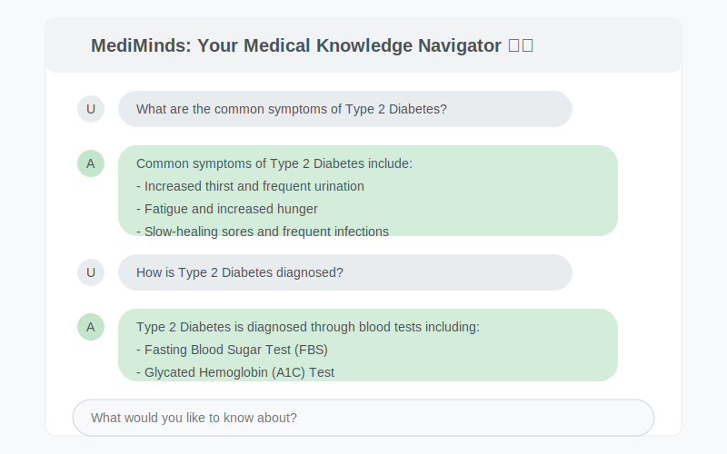

# MediMinds: AI-Powered Medical Knowledge Navigator 🧠💊

## 🌟 Overview
MediMinds is an intelligent medical chatbot that transforms your medical documents into an interactive knowledge base. Built with state-of-the-art AI technology, it helps medical professionals, students, and researchers quickly find and understand medical information from their documents.

## 🖥️ Interface & Usage Example

Here's how MediMinds looks in action:

<div align="center">

</div>

The interface shows:
1. Clean, intuitive chat interface
2. Direct question-answer format
3. Medical-specific responses
4. Easy-to-read formatting

## ✨ Features
- **🤖 Intelligent Responses**: Get concise, accurate answers based on your documents
- **💻 User-Friendly Interface**: Clean, intuitive chat interface for easy interaction
- **⚡ Fast Processing**: Quick response times with efficient document processing
- **🔒 Local Processing**: All documents are processed locally for privacy

## 🛠️ Technology Stack
- **LLM**: Mistral-7B-Instruct-v0.3
- **Embeddings**: Sentence Transformers (all-MiniLM-L6-v2)
- **Vector Store**: FAISS
- **Framework**: Langchain
- **Frontend**: Streamlit
- **Document Processing**: LangChain Document Loaders

## 📁 Project Structure
```
mediminds/
├── data/                           # Store your medical PDFs here
│   └── documents/
├── vector_db                       # FAISS index storage
│   ├── index.faiss
│   └── index.pkl
├── src/                            # Source code directory
|   ├── __init__.py
│   ├── llm/
│   │   ├── model_config.py
│   │   └── vectorstore_init.py
│   │   └── __init__.py
│   ├── app/
│   │   └── chatbot.py
│   │   └── __init__.py
│   └── utils/
│       └── config.py
│       └── __init__.py
├── .env               # HuggingFace API Token
├── setup.py           # Package setup
├── requirements.txt   # Dependencies
└── README.md         # Documentation
```

## 🚀 Getting Started

### Prerequisites
- Python 3.8+
- Hugging Face API Token
- Medical PDFs for the knowledge base

### Installation

1. **Clone the repository:**
```bash
git clone https://github.com/Manish-Kumar24/mediminds.git
cd mediminds
```

2. **Install dependencies:**
```bash
pip install -e .
```

3. **Set up your environment:**
   - Create a `.env` file in the root directory
   - Add your Hugging Face API token:
   ```
   HF_TOKEN=your_huggingface_token_here
   ```

4. **Add your medical PDFs:**
   - Place your PDF files in the `data/documents/` directory

5. **Initialize the vector store:**
```bash
python src/llm/vectorstore_init.py
```

6. **Run the application:**
```bash
streamlit run src/app/chatbot.py
```

## 💡 Example Usage

1. **Starting a conversation:**
   ```
   User: What are the common symptoms of Type 2 Diabetes?
   
   MediMinds: Common symptoms of Type 2 Diabetes include:
   - Increased thirst and frequent urination
   - Fatigue and increased hunger
   - Slow-healing sores and frequent infections
   ```

2. **Follow-up questions:**
   ```
   User: How is Type 2 Diabetes diagnosed?
   
   MediMinds: Type 2 Diabetes is diagnosed through blood tests including:
   - Fasting Blood Sugar Test (FBS)
   - Glycated Hemoglobin (A1C) Test
   ```

## ⚠️ Important Notes
- This chatbot's knowledge is limited to the documents you provide
- Always verify medical information with certified healthcare professionals
- Keep your documents up-to-date for the most accurate responses

## 🤝 Contributing
We welcome contributions! Please feel free to submit pull requests.

1. Fork the repository
2. Create your feature branch (`git checkout -b feature/AmazingFeature`)
3. Commit your changes (`git commit -m 'Add some AmazingFeature'`)
4. Push to the branch (`git push origin feature/AmazingFeature`)
5. Open a Pull Request

## 📝 License
This project is licensed under the MIT License - see the LICENSE file for details.

## 👥 Acknowledgments
- Hugging Face for the LLM infrastructure
- Langchain community for the framework
- Streamlit team for the UI framework

## 📮 Contact
For questions and support, please open an issue in the GitHub repository.

---
Made with ❤️ by Manish Kumar